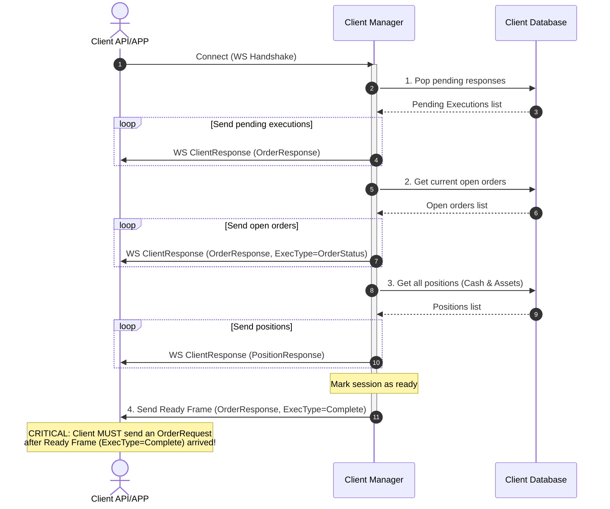
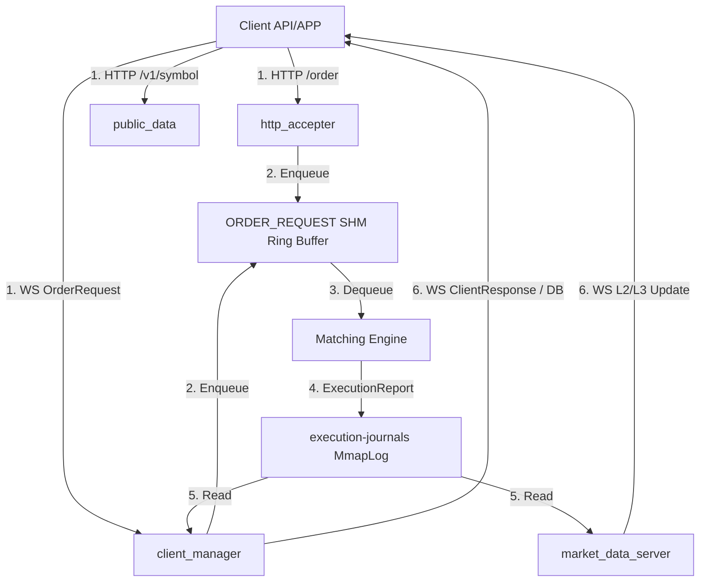
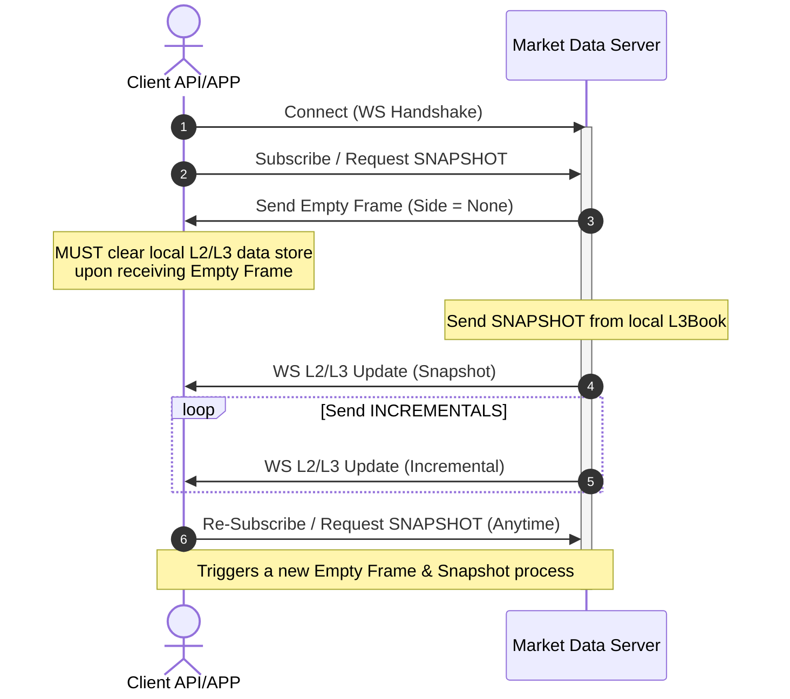
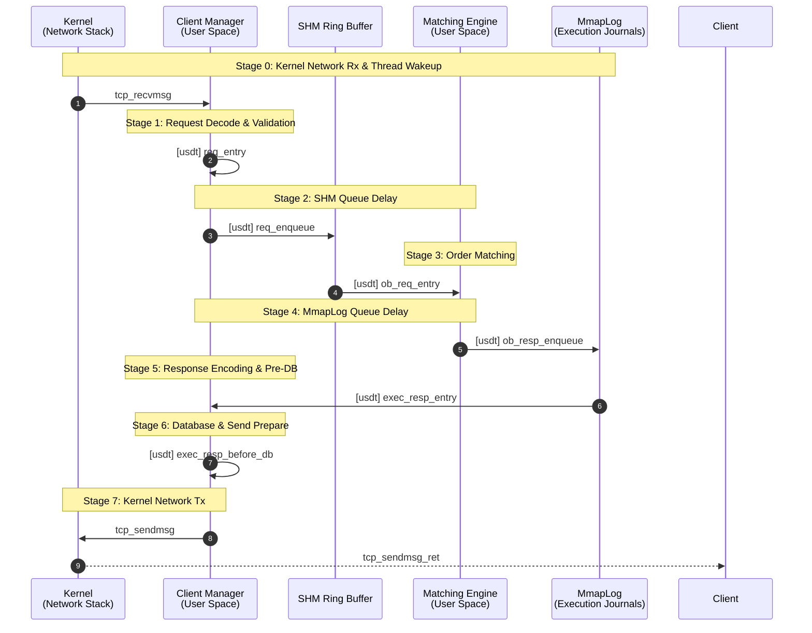

## Summary

It all started as a simple practice to build a C++ matching engine. However, the relentless pursuit of lower latency and higher throughput quickly escalated the scope. What began as a single component has evolved into a complete, high-performance exchange ecosystem.

Designed with a strong emphasis on low-latency architecture and systematic observability, the project now features a comprehensive suite of components:
- **Core Engine & Gateways:** A highly optimized Matching Engine decoupled from the Client Manager and HTTP Acceptors via lock-free Shared Memory (SHM) Ring Buffers.
- **Client & Market Data Protocols:** WebSocket-based streaming for L2/L3 order book updates and execution reports, utilizing zero-allocation FlatBuffers for ultra-fast serialization.
- **Observability (eBPF):** A custom Linux eBPF latency tracer (`lat-tracer`) that hooks into kernel network stacks (`tcp_recvmsg`/`tcp_sendmsg`) and user-space C++ functions (`uprobes`). It measures end-to-end latency at the microsecond level, mathematically isolating kernel network overhead from application processing time.
- **Automated Trading Agents:** A built-in C++ algorithmic trading ecosystem, including a Market Maker for liquidity provision and a Stress Trader for simulating high-frequency market chaos and load testing.
- **Modern Web Frontend:** A React/TypeScript UI featuring dynamic data throttling and state decoupling to handle massive bursts of order book updates without freezing the browser.

This project serves as a showcase of applying both low-level system engineering (eBPF, IPC, memory management) and big-picture architectural design (microservices, real-time web, state decoupling) to build a robust trading system.

## Requires

You can install all the required system dependencies by running:

```sh
./scripts/install-requirements
```

## LogOn process



## Order & Market Data flow



## L2/L3 Update & Subscription Phase



## eBPF Latency Tracer (lat-tracer)

The `lat-tracer` eBPF program measures end-to-end latency of order requests by hooking into kernel networking functions (`kprobes`) and user-space C++ functions via User Statically-Defined Tracing (`USDT`). It breaks down the total latency into 8 distinct stages, while also capturing Performance Monitoring Unit (PMU) metrics like CPU cycles, instructions, cache misses, and page faults for each stage.

### Latency Tracing Workflow

The latency tracing is divided into 8 stages to isolate time spent in kernel networking, application processing, and IPC queue delays:



#### Responsibilities

**Kernel Space (eBPF)**:
1. **Network Hooks (kprobes)**: Intercepts `tcp_recvmsg` to parse incoming FlatBuffer payloads and record start timestamps. Intercepts `tcp_sendmsg` to detect outbound responses and compute the final network Tx latency.
2. **Application Hooks (USDT)**: Attaches to compiled-in USDT tracepoints in `ClientManager` and `MatchingEngine` to track the exact lifecycle of an order across threads and processes.
3. **Hardware Performance Monitoring (PMU)**: Reads hardware perf counters (e.g., L1/LLC Cache Misses, Branch Misses, Instructions Per Cycle) and software events (context switches, page faults, runqueue delays) during each stage.
4. **Data Aggregation**: Bundles the 8-stage metrics into a `stage_sample` and pushes them to User Space via a BPF RingBuffer.

**User Space (C++)**:
1. **Setup**: Loads the BPF skeleton, configures perf_event arrays for hardware counters, and attaches USDT links to specific binary paths (`client-manager` and `matching-engine`).
2. **Processing**: Polls the Ring Buffer for `stage_sample` events. It aggregates all 8 stages for each `exec_id`.
3. **Analytics & Storage**: Once a complete message flow is reconstructed, it writes the multi-dimensional attribution data (latency, IPC, cache misses, etc., for each stage) into a CSV file (`latency_attribution.csv`) for further analysis.

## Demonstrated Capabilities

This project serves as a comprehensive showcase of my software engineering abilities, blending low-level system with high-level architecture and domain-specific financial technology knowledge.

**Software Engineering & Systems Design:**
- **Modern C++:** Extensive use of modern C++, carefully managing memory and object lifecycles to ensure stability and high performance.
- **System Architecture:** Designed a robust, decoupled microservice ecosystem capable of running reliably on Linux cloud VMs.
- **Lock-Free Data Structures:** Engineered lock-free shared memory (SHM) ring buffers and memory-mapped (Mmap) files for ultra-fast, zero-copy Inter-Process Communication (IPC).
- **Latency Engineering & Observability:** Built a custom kernel-to-user-space latency tracer using eBPF and USDT. Leveraged hardware PMU metrics (cache misses, IPC, page faults) to rigorously benchmark and eliminate microsecond-level bottlenecks.
- **Network Programming:** Developed robust server-side networking using WebSockets and HTTP to handle high-frequency data streams.
- **Data Schema & Flow Design:** Utilized FlatBuffers for zero-allocation serialization, ensuring strict data schemas and minimizing GC/heap overhead across the pipeline.
- **Frontend "Vibe Coding" & UI/UX Design:** Designed a premium, highly dynamic, and visually polished React/TypeScript frontend. Prioritized an exceptional user experience (UX) with intuitive layouts that cleanly throttle and render massive bursts of live orderbook updates without visual stuttering or UI freezing.
- **Linux System Tuning:** Applied advanced OS-level optimizations, including thread CPU affinity, RT scheduling, THP disabling, and `ksoftirqd` prioritization.

**Trading & Market Infrastructure:**
- **Matching Engine Logic:** Implemented a deterministic, high-throughput matching engine supporting strict price-time priority, partial fills, rapid cancellations, and real-time execution reporting.
- **Orderbook Reconstruction:** Managed L2/L3 market data state, gracefully handling snapshot generation and reliable incremental streaming sequences.
- **Algorithmic Trading & Stress Testing:** Developed automated C++ trading clients (Market Makers and Chaos Stress Testers) to inject liquidity and rigorously load-test the infrastructure.

## License

This project is licensed under the MIT License - see the [LICENSE](LICENSE) file for details.
