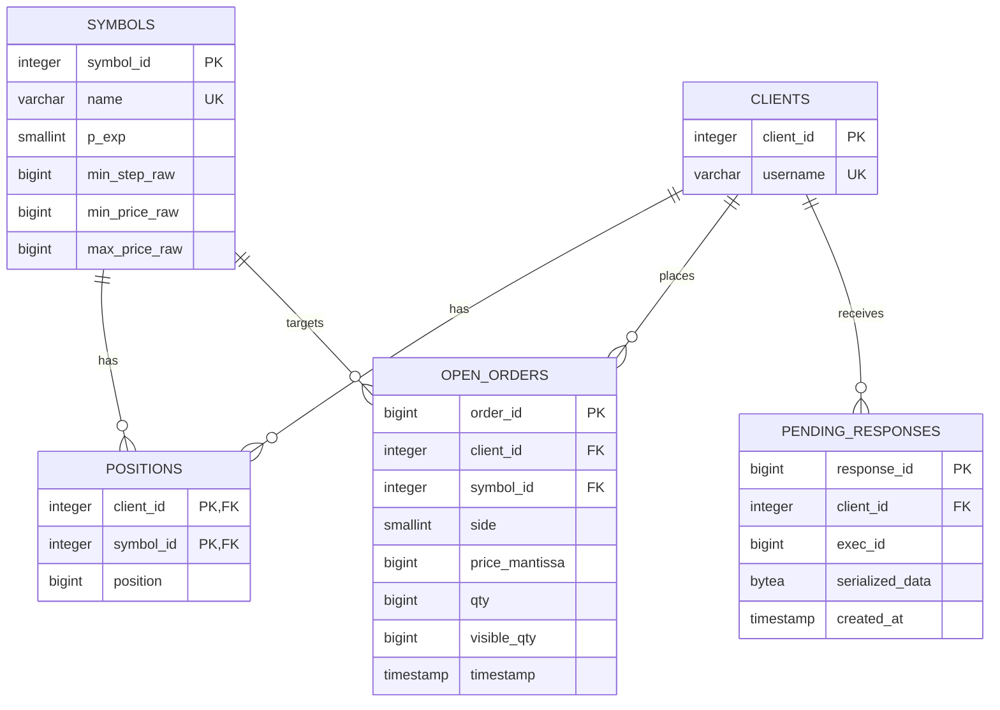

# PostgreSQL Database Schema Design for Exchange

This document outlines the database schema design to replace the current `InMemoryClientDatabase` with PostgreSQL.

## 1. Schema Diagram (Conceptual)



## 2. Table Definitions

### `symbols` Table
Stores configured trading symbols and their scale / boundaries.
```sql
CREATE TABLE symbols (
    symbol_id SERIAL PRIMARY KEY,
    name VARCHAR(32) NOT NULL UNIQUE,
    p_exp SMALLINT NOT NULL,              -- e.g., -1 for 0.1 scale (10^-1)
    min_step_raw BIGINT NOT NULL,          -- Integer representation of step
    min_price_raw BIGINT NOT NULL,         -- Integer representation of min price
    max_price_raw BIGINT NOT NULL,         -- Integer representation of max price
    created_at TIMESTAMP DEFAULT CURRENT_TIMESTAMP
);
```

### `clients` Table
Stores client/trader identity details.
```sql
CREATE TABLE clients (
    client_id SERIAL PRIMARY KEY,
    username VARCHAR(64) NOT NULL UNIQUE,
    created_at TIMESTAMP DEFAULT CURRENT_TIMESTAMP
);
```

### `positions` Table
Tracks assets and cash balances. Cash is tracked as `symbol_id = 0`.
```sql
CREATE TABLE positions (
    client_id INTEGER REFERENCES clients(client_id) ON DELETE CASCADE,
    symbol_id INTEGER NOT NULL,            -- 0 represents USD/Cash, >0 represents asset symbol_id
    position BIGINT NOT NULL DEFAULT 0,
    updated_at TIMESTAMP DEFAULT CURRENT_TIMESTAMP,
    PRIMARY KEY (client_id, symbol_id)
);
```

### `open_orders` Table
Tracks active open orders in the book.
```sql
CREATE TABLE open_orders (
    order_id BIGINT PRIMARY KEY,
    client_id INTEGER REFERENCES clients(client_id) ON DELETE CASCADE,
    symbol_id INTEGER REFERENCES symbols(symbol_id),
    side SMALLINT NOT NULL,                -- 0: Buy, 1: Sell
    price_mantissa BIGINT NOT NULL,        -- Only stores the price mantissa
    qty BIGINT NOT NULL,
    visible_qty BIGINT NOT NULL DEFAULT 0,
    timestamp TIMESTAMP NOT NULL,
    updated_at TIMESTAMP DEFAULT CURRENT_TIMESTAMP
);
```

### `pending_responses` Table
Stores execution responses that occurred while the client was offline.
```sql
CREATE TABLE pending_responses (
    response_id BIGSERIAL PRIMARY KEY,
    client_id INTEGER REFERENCES clients(client_id) ON DELETE CASCADE,
    exec_id BIGINT NOT NULL,
    serialized_data BYTEA NOT NULL,        -- FlatBuffers payload
    created_at TIMESTAMP DEFAULT CURRENT_TIMESTAMP
);

CREATE INDEX idx_pending_responses_client ON pending_responses(client_id);
```
