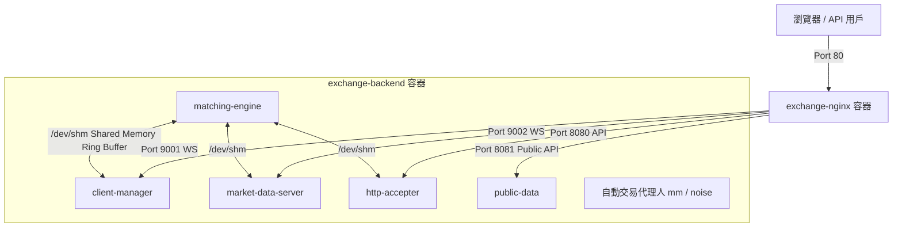

# Exchange 服務 Docker 化部署與運行指南

本文件詳細記錄了本交易所系統（Exchange）的 Docker 容器化部署流程、架構設計、安裝步驟以及維護指令。

---

## 1. 容器化架構設計

為了解決低延遲 IPC、記憶體資料庫以及反向代理的整合，本專案採用了雙容器（Dual-Container）的架構：



### 關鍵設計亮點
* **共享記憶體通訊 (POSIX SHM)**：後端核心 C++ 服務與交易代理人透過 `/dev/shm` 進行 lock-free 環形緩衝區通訊。為了解免複雜的跨容器共享，我們將**所有 C++ 進程打包於同一個 `backend` 容器內執行**，並設定 `shm_size: 512mb`。
* **記憶體資料庫編譯 (In-Memory DB)**：在 Dockerfile 中採用 `USE_PGSQL=0` 參數進行編譯，完全排除 PostgreSQL 依賴，改用 C++ 內建的記憶體資料庫，實現單機輕量運作。
* **系統性能調優 (SYS_NICE)**：給予 `backend` 容器 `SYS_NICE` 權限，允許 C++ 服務正常調用 `chrt` 即時優先級與 `taskset` CPU 親和性綁定。
* **保留 Tmux 操作介面**：後端依然透過 tmux 啟動與管理，開發者可直接附加至容器內的 tmux session 進行即時除錯與監控。

---

## 2. 相關 Docker 設定檔案說明

* **[Dockerfile.backend](file:///home/harvey/exchange/Dockerfile.backend)**：基於 Ubuntu 22.04，安裝 C++ 編譯環境，並以 `USE_PGSQL=0` 編譯後端五大核心服務與四個代理人。
* **[Dockerfile.nginx](file:///home/harvey/exchange/Dockerfile.nginx)**：多階段構建。第一階段在 Node.js 中使用 `flatc` 編譯 FlatBuffers TS 結構並編譯 React 前端靜態網頁；第二階段將靜態檔案複製到 nginx:alpine 映像檔中。
* **[nginx/exchange-docker.conf](file:///home/harvey/exchange/nginx/exchange-docker.conf)**：專為 Docker 環境設計的 Nginx 設定檔，反向代理目標皆指向 `backend` 容器服務。
* **[entrypoint.sh](file:///home/harvey/exchange/entrypoint.sh)**：清理舊的 `/dev/shm` 殘留，呼叫 `./run-all` 啟動服務，並以 `tail -f log/*.log` 持續將 C++ 日誌輸出至 Docker 標準輸出。
* **[docker-compose.yml](file:///home/harvey/exchange/docker-compose.yml)**：編排整個 Exchange 雙容器系統的啟動與權限設定。

---

## 3. 完整操作流程

以下是在一台全新主機上（以 Ubuntu 26.04 為例）從零開始的完整部署與運行步驟：

### 步驟 3.1: 安裝 Docker 與 Docker Compose

```bash
# 更新系統套件庫
sudo apt-get update

# 安裝 Docker 與 Compose 插件
sudo apt-get install -y docker.io docker-compose-v2

# 設定開機啟動 Docker 服務
sudo systemctl enable --now docker
```

---

### 步驟 3.2: 構建與啟動容器
在專案根目錄 `/home/harvey/exchange` 中執行：

```bash
# 1. 構建映像檔（會編譯 C++ 與前端網頁）
sudo docker compose build

# 2. 在背景啟動服務
sudo docker compose up -d
```
啟動後，網頁前端會運行在主機的 `80` 連接埠，可在瀏覽器直接輸入主機 IP 即可存取。

---

### 步驟 3.3: 常見日常運維指令

#### A. 查看容器執行狀態
```bash
sudo docker compose ps
```

#### B. 查看即時日誌流 (Docker Logs)
```bash
sudo docker compose logs -f
```

#### C. 進入 Tmux 查看實時交易監控（推薦）
您可以隨時附加到 backend 容器中的 tmux 會話，查看引擎與 MM/Noise 交易代理人的實時控制台：

* **監控核心後端服務** (Matching Engine、Client Manager 等)：
  ```bash
  sudo docker exec -it exchange-backend tmux attach -t exchange
  ```
* **監控自動交易代理人** (Market Maker / Noise Traders)：
  ```bash
  sudo docker exec -it exchange-backend tmux attach -t exchange_agents
  ```

> 💡 **小撇步**：在 tmux 附著狀態下，如需退出，請按 **`Ctrl+B` 隨後放開，再按 `D`**。千萬不要使用 `Ctrl+C` 否則會直接關閉服務。

#### D. 停止所有服務與清理容器
```bash
sudo docker compose down
```

#### E. 修改代碼後重新編譯並部署
若您修改了 C++ 代碼或前端網頁，只需重新 build 並重啟即可：
```bash
# 重新編譯
sudo docker compose build

# 重啟服務
sudo docker compose up -d
```
