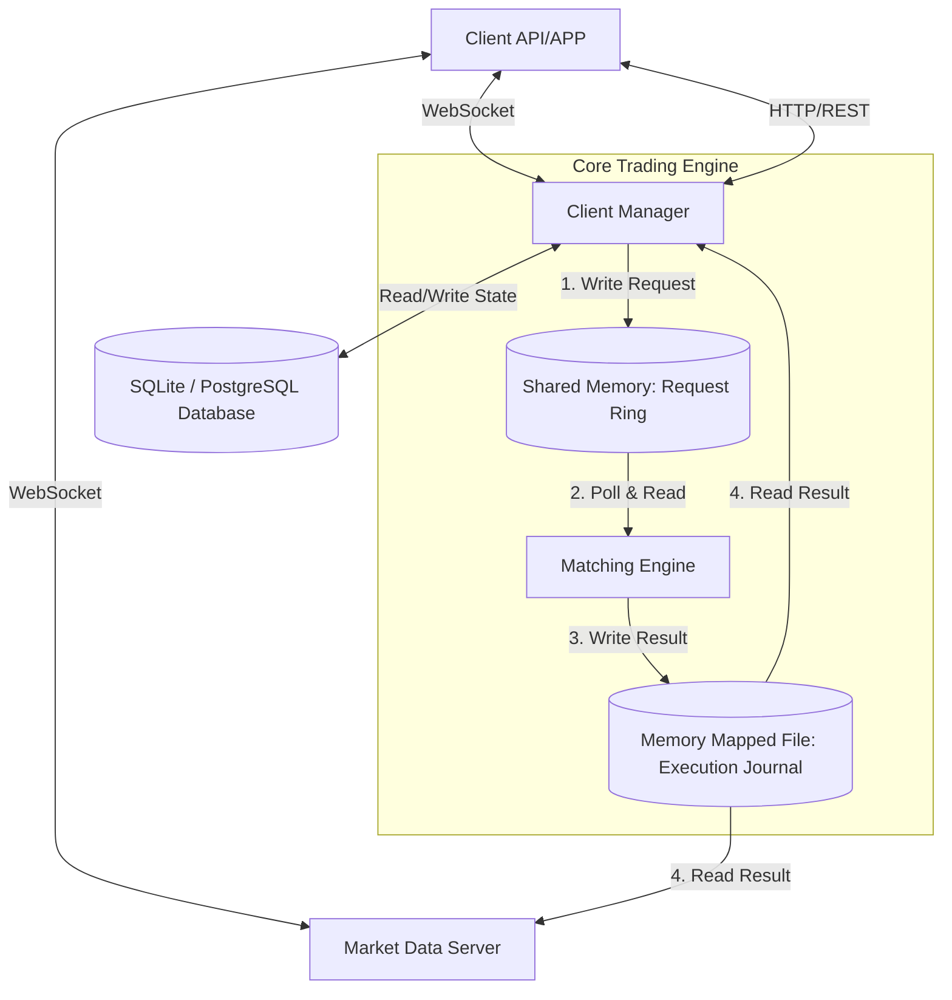
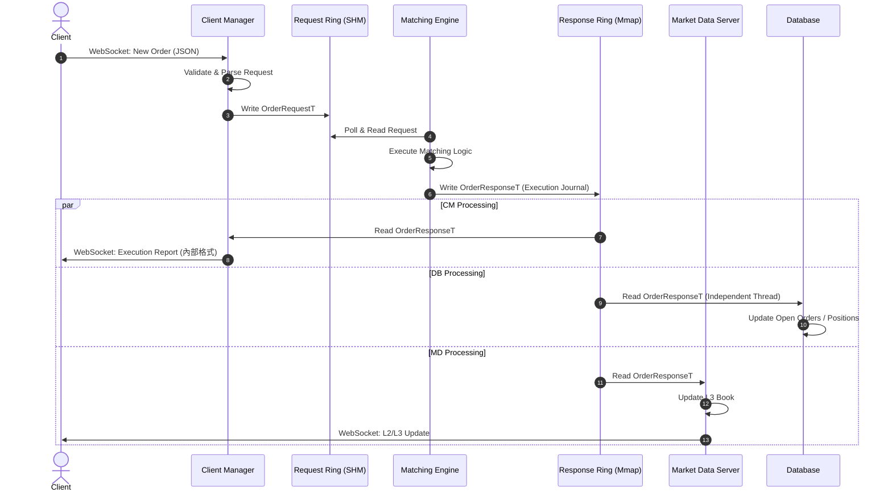
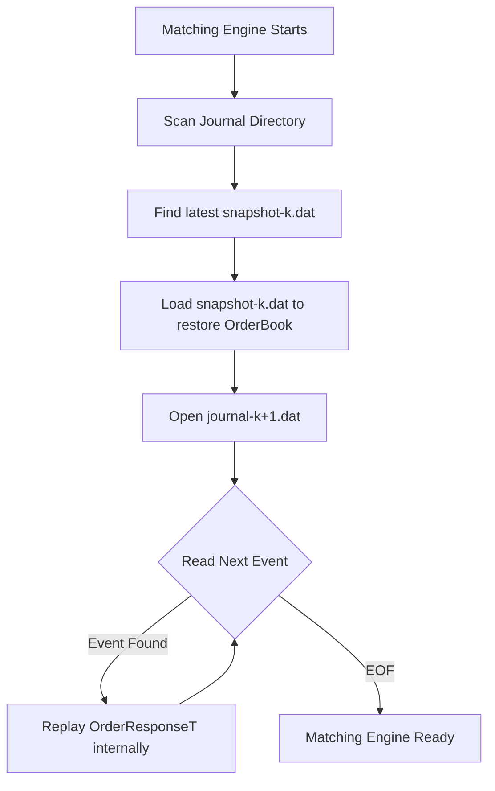

# 基礎架構與系統設計 (Basics & Architecture)

本文件旨在提供交易所核心系統的架構總覽、資料流路徑、以及關鍵的高可用性 (HA) 與狀態同步機制，適合核心開發者與架構工程師閱讀。

## 1. 系統總覽 (System Overview)

本交易所採用高效能的分散式微服務架構，核心模組透過 Shared Memory Ring Buffer 進行極低延遲的行程間通訊 (IPC)。

核心服務包含：
- **Client Manager (CM)**：負責處理來自客戶端的連線 (TCP/WebSocket)，進行身分驗證，並將下單請求 (Request) 轉換為內部二進位格式寫入 Request Ring。它同時監聽 Response Ring，將執行回報 (Execution Report) 推送給客戶端。
- **Matching Engine (ME)**：核心撮合引擎。透過 Busy-polling 讀取 Request Ring 中的委託單，進行價格/時間優先 (Price-Time Priority) 的撮合，並將結果寫出到 Response Ring (Execution Journal)。
- **Market Data Server (MD)**：獨立於撮合引擎之外的服務。監聽 Response Ring，讀取撮合結果並維護 L2/L3 Order Book 的狀態，最後將市場報價推播給公開訂閱的客戶端。
- **SQLite Database**：作為持久化層，記錄 Open Orders, Positions 等帳戶狀態。

### 行程間通訊 (IPC)
所有核心服務之間的資料交換，皆透過 **Shared Memory Ring Buffer** (基於 POSIX shared memory 與 mmap)。這確保了 ME 不會因為網路 I/O 或 DB 寫入而阻塞，實現了單一執行緒 (Single-threaded) 處理百萬級別吞吐量的能力。

---

## 2. 資料流向 (Data Flow)

一筆新委託 (New Order) 的生命週期與資料流路徑如下：

1. **Client -> CM**：客戶端透過 WebSocket 發送 JSON 格式的下單請求。
2. **CM 驗證與寫入**：CM 驗證 Token 與 Sequence Number，將 JSON 解析後組裝成內部委託請求，寫入 `/ORDER_REQUEST` Ring Buffer。
3. **ME 撮合**：Matching Engine 從 Request Ring 讀取出單，更新內部的 `OrderBook`。如果發生撮合，產生 `PartialFill` 或 `Fill` 事件；否則產生 `New` 事件。
4. **ME 輸出結果**：ME 將結果組裝成內部執行回報，寫出到 Response Ring。**注意：這裡的 Response Ring 實際上是透過 append-only 的 Memory-Mapped File (mmap log) 實作的，也就是所謂的 Execution Journal。**這讓資料交換與硬碟持久化在同一時間完成。
5. **CM / MD 讀取結果**：
   - **CM** 透過 `MmapReader` 讀取到結果後，將結果發送回給該 Client。
   - **DB** 透過獨立的 Polling Thread 讀取到結果後，更新資料庫裡的 Open Orders 與 Positions。
   - **MD** 透過 `MmapReader` 讀取到結果後，更新自己的 L3Book，並產生 L2 Order Book Snapshot 或 Delta Update 發送給所有訂閱報價的 Clients。

---

## 3. 高可用性與災難復原 (HA & Crash Recovery)

為了確保在 Matching Engine 崩潰時能夠快速且準確地恢復狀態，我們實作了基於 Snapshot (快照) 與 Journal Replay (日誌重播) 的 Deterministic 復原機制。

### Execution Journal (Response Ring) 落地機制
如前所述，Response Ring 本質上就是硬碟上的 `mmaplog` (例如 `journal-k.dat`)。當 ME 呼叫 `mmaplog::MmapWriter` 寫入結果時，資料同時進入了 Page Cache 並對其他行程 (CM, MD) 可見，同時也完成了落盤準備，實現了 IPC 與 Persistence 的統一。

### Snapshot 的觸發條件
當目前的 `journal-k` 達到容量上限觸發 Rollover (換檔) 產生 `journal-{k+1}` 時，會觸發一個 Callback，指示 `OrderBook` 遍歷當前所有的有效委託單，並按照時間優先順序寫出二進位的 `snapshot-<symbol_id>-<k>.dat`。

### ME 重啟時的 Deterministic State Replay
1. ME 啟動時掃描 Journal 目錄，找出最新的 Snapshot 索引 `k`。
2. 直接載入 `snapshot-k`，重建當時的 Order Book 狀態 (完全保留時間優先權序位)。
3. 開啟 `journal-{k+1}`，依序讀取後續所有的 `OrderResponseT`。
4. 將 `OrderResponseT` 反向翻譯為 `OrderRequestT`，並重新丟回 `processRequest()` 進行重播 (Replay)。這保證了復原後的狀態與當初崩潰前 **100% 相同**。

---

## 4. 狀態管理與同步 (Sequence Number)

為了在不穩定的網路環境中確保操作的**冪等性 (Idempotency)**，並允許斷線重連後的狀態補齊，系統採用了嚴格的序號 (Sequence Number) 策略：

- **Mmap Offset (Journal Offset)**：標示交易所整體事件發生在 Memory-Mapped File 中的絕對偏移量，用於內部系統狀態對齊與事件追蹤。
- **Inbound SeqNum (ISeqNum)**：Client -> Server 的訊息序號。
- **Outbound SeqNum (OSeqNum)**：Server -> Client 的訊息序號。

**登入與重連機制**：
- 客戶端在登入 (Login) 訊息中必須夾帶自己預期的 `MsgSeqNum` 與 `AckSeqNum`。
- 如果 Client 送了較低的 `AckSeqNum`，代表 Client 遺漏了 Server 過去發送的訊息，Server 會從 DB 把遺漏的 Executions 撈出並重傳，最後才發送 `Ready` 給 Client。
- 若序號不合理 (例如 Client 的 MsgSeqNum 大過頭)，則 Server 會拒絕連線並告知預期的序號，由 Client 自行決定是否重置狀態。
- 登入時**不會**主動發送 Positions/Open Orders。客戶端應透過 WebSocket 發送 `OpenOrderRequest` 與 `PositionRequest` 查詢當下狀態。
