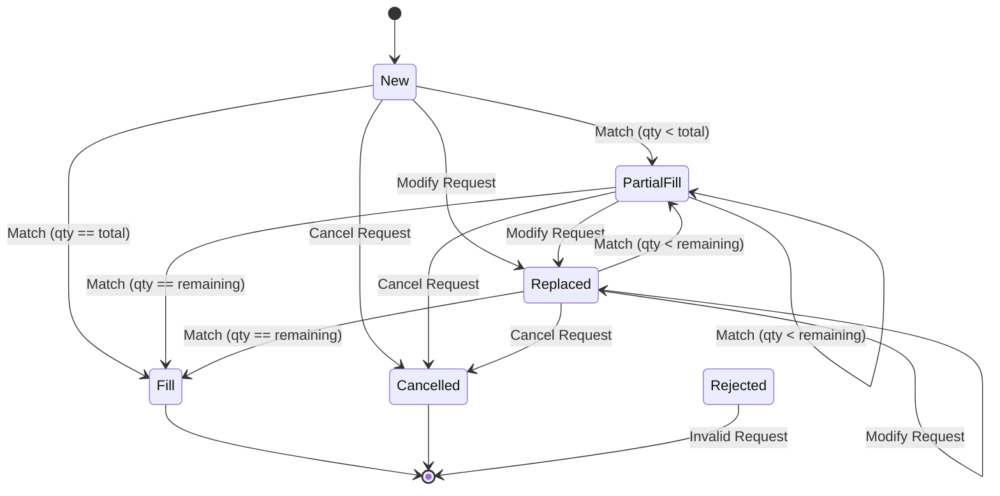

# API 開發者指南 (API Developer Guide)

本指南專為量化交易員、造市商 (Market Maker) 與演算法開發者編寫，詳細說明如何透過 WebSocket 連接我們的交易所、傳遞認證資訊、發送委託，並處理執行回報。

## 1. 連線與認證 (Connection & Auth)

本交易所完全透過 WebSocket (WS) 提供極低延遲的交易 API。交易網路層與應用層高度解耦，所有的 Client 連線都會對應到專屬的 Session 物件以確保高吞吐量的訊息隔離。

### 端點與協定
- **Client Manager 端點**：負責接受下單 (New, Modify, Cancel) 與私有帳戶回報 (Execution Reports)。
- **通訊格式**：完全使用二進位 Flatbuffer，不支援 JSON。
- **序列號 (Sequence Number)**：
  - 客戶端與伺服器之間維護嚴格的 `MsgSeqNum` 與 `AckSeqNum`。
  - **登入 (Login)** 時，客戶端必須夾帶預期的 SeqNum。如果發生斷線，客戶端重連時提供正確的 `AckSeqNum`，伺服器會自動把遺漏的 Execution Reports 補齊並重傳。如果客戶端的 SeqNum 發生不可修復的落後，伺服器會拒絕連線。

---

## 2. 請求格式 (Request Specification)

所有的下單請求都會被轉換為內部的 `OrderRequestT`。以下是核心操作：

### 2.1 新增委託 (New Order)
傳入 `Action = New`，指定：
- `client_id`：你的帳戶 ID。
- `order_id`：由 Client 端生成的唯一訂單編號。
- `symbol_id`：交易對 ID。
- `side`：Buy 或 Sell。
- `type`：Limit 或 Market。
- `p`：委託價格 (Market Order 填 0)。
- `q`：委託總量。

### 2.2 修改委託 (Modify Order)
傳入 `Action = Modify`，針對已掛單的 `order_id`：
- `p`：修改後的新價格。
- `q`：修改後的**目標總量 (New Target OrderQty)**。
> ⚠️ **注意**：修改委託時，請求中的 `q` 代表的是「這張單的總量希望變成多少」，而不是剩餘數量。系統會自動扣除已成交數量來推算新的剩餘量。

### 2.3 取消委託 (Cancel Order)
傳入 `Action = Cancel`，並帶上對應的 `order_id`。

---

## 3. 回報格式與生命週期 (Response & ExecType Semantics)

伺服器會將 Matching Engine 的撮合結果推播給您。為追求極致的傳輸效能與語意清晰度，我們將 `Price (p)`、`Quantity (q)` 與 `Remaining Quantity (q_rem)` 在不同的 `ExecType` (執行狀態) 下賦予了精確的定義。

請**嚴格參考以下核心語意表**來實作您的本地記帳邏輯：

| ExecType (執行狀態) | `p` (Price) | `q` (Quantity) | `q_rem` (Remaining Quantity) | 說明 (與 FIX Protocol 的對應) |
| :--- | :--- | :--- | :--- | :--- |
| **`New`** (新增成功) | **掛單價格** *(Market order 則為 0)* | **委託總量** | **委託總量** | 確認收單，此時 `q_rem` 等於委託總量 (`LeavesQty`)。 |
| **`Replaced`** (修改成功) | **修改後的新價格** | **修改後的目標總量** | **修改後的新剩餘量** | **狀態覆蓋**。MD 與 DB 會直接將剩餘數量覆蓋為 `q_rem`。 |
| **`PartialFill`** (部分成交) | **本次成交價格** | **本次成交數量** | **成交後的剩餘數量** | **交易事件**。代表在此價格下搓合了多少數量 (`LastQty`)，以及剩下多少 (`q_rem`)。 |
| **`Fill`** (完全成交) | **本次成交價格** | **本次成交數量** | **`0`** | 同上。這筆單完成搓合，剩餘數量歸零。 |
| **`Cancelled`** (取消成功) | **取消前的掛單價格** | **原委託數量或 `0`** | **`0`** | 狀態覆蓋。直接告知該訂單已不存在 (`q_rem = 0`)。 |
| **`Rejected`** (拒絕請求) | **被拒絕的請求價格** | **被拒絕的請求數量** | **`0`** | 將 Client 原本送來的不合法參數原封不動退回，並附帶 Reject Code 供 Client 檢查。 |

### 設計亮點 (Explicit Remaining Quantity)
過去為了節省頻寬，`q` 在不同狀態下會切換語意（有時代表成交量，有時代表剩餘量）。
現在新增了獨立的 `q_rem` 欄位，這讓語意變得極度清晰且不會混淆：
1. **`q` (Quantity)**：代表本次事件的「**變動量**」或「**目標量**」。在成交事件 (`PartialFill`, `Fill`) 中，它永遠是**單筆成交量 (LastQty)**，讓演算法交易員能直接用來精確計算均價與成交總額。
2. **`q_rem` (Remaining Quantity)**：代表事件發生後的「**實際剩餘總量 (LeavesQty)**」。只要收到任何回報，直接將本地 Open Orders 的剩餘數量覆蓋為此欄位的值即可，無需自行加減推算。

---