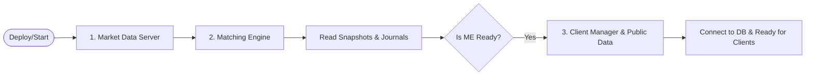
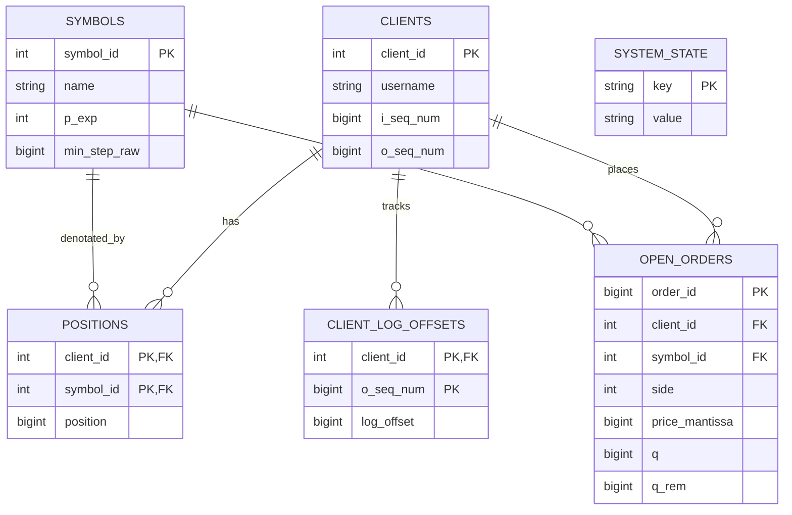

# 部署與維運指南 (Operations & Deployment Guide)

本文件專為系統管理員、SRE (Site Reliability Engineer) 與 DevOps 工程師編寫，說明如何部署、啟動及監控交易所的核心服務，以及資料庫的設計理念。

---

## 1. 系統環境與建置 (Environment & Build)

### 建議作業系統與硬體
- **OS**: Linux (推薦 Ubuntu 26.04)
- **CPU**: 支援高時脈的處理器 (e.g., Intel Xeon / AMD EPYC)。若要達到最佳延遲，請關閉 C-states 並預留 (Pin) 特定核心給 Matching Engine。
- **Memory**: 至少 16GB。因為依賴大量的 Shared Memory Ring Buffer，建議配置充足的 RAM (至少需要 1GB 供 `/dev/shm` 使用)。
- **Storage**: 高速 NVMe SSD 用於 Execution Journal 落盤。

### 部署方式 1：使用 Docker (推薦)
系統已全面支援 Docker 容器化部署，所有相依套件與編譯過程皆在容器內完成。
```bash
# 啟動並在背景執行 (首次執行會自動進行映像檔編譯)
docker compose up --build -d
```
詳細容器操作請參考 [docker.md](docker.md)。

### 部署方式 2：Bare-metal 實機編譯 (適用於開發或追求極致延遲)
若需直接在主機上編譯與執行，請先安裝依賴套件：
```bash
./scripts/install-requirements
```
系統使用 GNU Make 構建：
```bash
# 生成 FlatBuffers 並編譯所有微服務與前端
make -j$(nproc) all
# 啟動服務
sudo ./run-services
```

---

## 2. 服務啟動順序 (Startup Sequence)

交易所的微服務透過 Shared Memory 通訊，因此存在啟動相依性：




1. **Market Data Server (`market-data-server`)**
   - 負責建立 L3 Book，並隨時準備對外廣播。
2. **Matching Engine (`matching-engine`)**
   - 必須確保 Response Ring 已經準備好寫入。啟動時，它會自動掃描 Journal 目錄進行 Snapshot 與 Journal Replay 重建內部狀態。
3. **Public Data Server (`public-data`)**
   - 負責提供 REST API 查詢系統基礎參數 (如 Symbol Info)。
4. **Client Manager (`client-manager`)**
   - 最後啟動。它啟動後，才開始在 WebSocket 接受外部 Client 連線，並將請求放入 Request Ring。

> **關閉順序 (Shutdown)**：請依照 `Client Manager` -> `Matching Engine` -> `Market Data Server` 的順序優雅關閉，確保所有正在排隊的委託都被處理完畢。

---

## 3. 資料庫與持久化 (Database Schema)

Client Manager 使用 SQL 資料庫 (支援 SQLite/PostgreSQL) 來保存與客戶端帳戶相關的狀態。核心撮合狀態 (Order Book) **不依賴**關聯式資料庫，而是依賴二進位的 Snapshot 與 Journal。




### 核心資料表 (Core Tables)

- **`symbols` (商品清單)**：
  存放所有可交易的貨幣對與價格精度 (`p_exp`)。
- **`clients` (客戶端資訊)**：
  記錄登入帳號、認證資訊，以及用來維護通訊冪等性的 `i_seq_num` (Inbound Sequence) 與 `o_seq_num` (Outbound Sequence)。
- **`positions` (資產與部位)**：
  記錄每個客戶擁有的貨幣資產數量。`symbol_id = 0` 通常保留為法幣/報價幣 (e.g., USD)。
- **`open_orders` (當前有效委託)**：
  這張表僅用來回答客戶端的「當下掛單查詢」請求。
  - 其中的 `qty` 欄位代表 **`rem_qty` (剩餘未成交數量)**。
  - 當收到 Matching Engine 傳來的 `ExecType_PartialFill` 或是 `ExecType_Replaced` 時，此欄位會直接被覆寫更新。
- **`client_log_offsets` (遺漏回報重構對應表)**：
  記錄 `o_seq_num` 對應的 `log_offset`。當客戶端斷線重連時，Client Manager 透過此表查出漏掉的 `o_seq_num` 所對應的 Mmap Offset，並直接從 Execution Journal 重讀資料進行補發，因此不需要實際暫存二進位資料。
- **`system_state`**：
  記錄 DB Polling Thread 讀取 Execution Journal 的進度 (`log_offset`)，確保重啟後不會重複處理。

---

## 4. 日誌與監控 (Logging & Monitoring)

- **Execution Journal**：
  這是系統最重要的資產，位於 `journals/` 目錄。
  檔案命名規則為 `journal-<index>.dat` 與 `snapshot-<symbol_id>-<index>.dat`。
