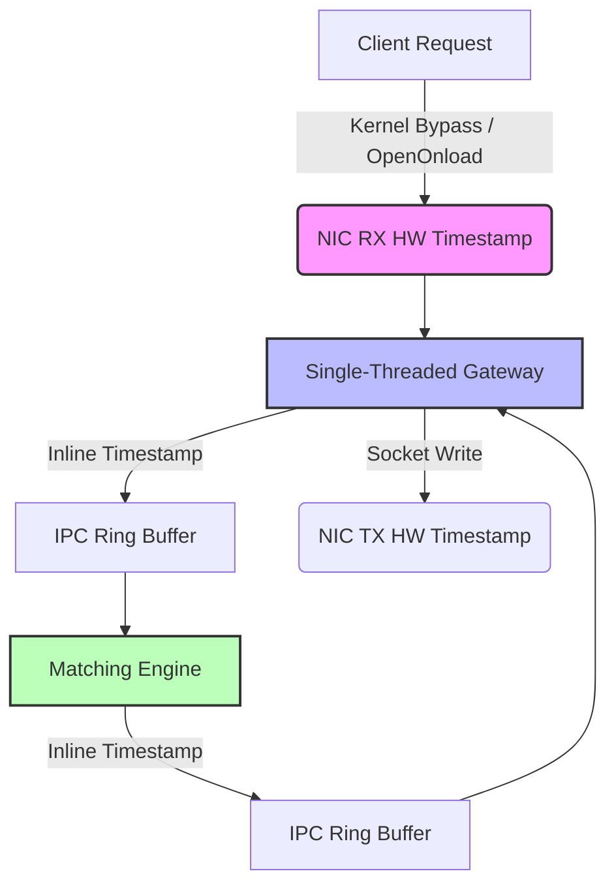

# Exchange-Core Performance Testing & Observability Analysis
*Compiled by 20+ Year Staff Low-Latency Engineer*

---

## 1. Executive Summary

This report evaluates the current performance testing and observability architecture of `exchange-core`. 

While the use of lock-free ring buffers (MPSC) and eBPF kernel-level socket tracing (`tcp_recvmsg` / `tcp_sendmsg`) is a solid foundation, several **critical blind spots** and **architectural bottlenecks** are currently masking the true behavior of the system under stress. 

The most alarming observation is the **massive discrepancy between Client RTT (up to 2.5s) and Server Telemetry E2E (31ms) under high load**. This is a classic symptom of kernel socket buffer queueing delays which are completely invisible to the current eBPF tracer.

---

## 2. What the Current Observability Sees (And Does Right)

Your current setup focuses on three main layers:
1. **Shared Memory Ring Buffer Monitor (`ring_monitor.cpp`)**:
   - Provides a real-time (10ms/500ms) view of the queues (`ORDER_REQUEST`, `ORDER_RESPONSE`, etc.).
   - Visualizes capacity, committed/uncommitted depth, and occupancy.
2. **eBPF-based Latency Tracer (`lat-tracer.bpf.c` & `lat-tracer.cpp`)**:
   - Captures socket traffic on port `9001` via `kprobe`/`kretprobe` on `tcp_recvmsg` and `tcp_sendmsg`.
   - Parses WebSocket framing and extracts the FlatBuffers `exec_id` in user space to calculate delta latency.
   - Breaks latency down into:
     - `kernel - manager`: Network stack + WebSocket framing.
     - `manager - engine`: Gateway processing + IPC queueing delay.
     - `engine`: Matching engine execution time.

---

## 3. Critical Blind Spots (What You Aren't Seeing)

### 🚨 Blind Spot #1: `tcp_recvmsg` is NOT Network Arrival (The Ingress Queue Illusion)
Your eBPF probe hooks `kretprobe/tcp_recvmsg` to record `timestamp_ns` (RX).
* **The Problem**: `tcp_recvmsg` is called by user space (`ClientManager`) to retrieve data from the socket. If the `ClientManager` is busy or blocked, incoming TCP packets accumulate in the kernel's TCP socket receive buffer. The client's clock has already started (RTT), but our eBPF trace assumes the packet *just arrived* at the machine when `tcp_recvmsg` returns.
* **Impact**: Under high load (e.g., 1079 tps), Client RTT is **381.5 ms**, while Telemetry E2E shows only **6.3 ms**. The request spent **~375 ms** sitting in the kernel socket queue, completely invisible to the "kernel - manager" telemetry. 

### 🚨 Blind Spot #2: Coarse-Grained Queue Sampling (Micro-burst Blindness)
* **The Problem**: `ring_monitor.cpp` samples the ring buffers at coarse intervals.
* **Impact**: Low-latency systems suffer from micro-bursts where queues saturate and drain within 50 microseconds. A 10ms sampling interval will show `0%` occupancy, even if the queue was full and dropping/blocking packets multiple times within that window.

### 🚨 Blind Spot #3: TSC Core Drift and Jittery Calibration
* **The Problem**: `lat-tracer.cpp` and `stress-trader.cpp` calibrate `tsc_hz` dynamically at startup using a `sleep_for(50ms)` window.
* **Impact**: OS scheduling jitter makes a 50ms window highly inaccurate for calibrating GHz-level CPU cycles. Furthermore, if `ClientManager` and `MatchingEngine` run on different CPU cores, subtracting their TSC timestamps assumes core synchronization. Without invariant TSC (`constant_tsc` and `nonstop_tsc`) and synchronized sockets, these deltas will drift, occasionally producing negative values or skewed metrics.

---

## 4. Architectural Bottlenecks & Code Flaws

### ⚠️ Flaw #1: Redundant Mutexes in a Single-Threaded Cooperative Event Loop (Removed)
In the original implementation of `client-manager.cpp`:
```cpp
std::lock_guard<std::mutex> lock(metrics_mutex_);
order_start_times_[order_req->exec_id()] = Exchange::read_tsc_begin();
```
* **The Critique**: The codebase originally declared and locked `metrics_mutex_` on both request ingress and response egress to protect `order_start_times_`.
* **The Truth**: The `client_manager` runs its socket event loop (`manager.poll()`) and ring buffer polling (`response_ring->dequeue()`) sequentially in a single thread. Since there is **no multi-threaded concurrency**, the mutex was completely redundant. Even without contention, acquiring and releasing mutexes forces atomic instructions (e.g. `lock cmpxchg`) and memory barriers that serialize the CPU pipeline.
* **Action Taken**: We have fully removed `metrics_mutex_` from `client-manager.cpp`.

### ⚠️ Flaw #2: Polling Loop Sleep Backoff (`sleep_for(1ms)`)
In `define.hpp`:
```cpp
#ifndef PRODUCTION_MODE
  #define POLL_BACKOFF() std::this_thread::sleep_for(std::chrono::milliseconds(POLL_SLEEP_MS))
#endif
```
* **The Problem**: If you are compiling your tests on a machine with fewer than 8 cores (which disables `PRODUCTION_MODE` in the `Makefile`), the `ClientManager` and `MatchingEngine` sleep for 1ms when queues are empty.
* **Impact**: A 1ms sleep introduces a massive scheduling delay. Even if the Matching Engine processes the request in 20us, the response will sit in `ORDER_RESPONSE` until `ClientManager` wakes up, pegging your idle E2E latency at **1.2ms**.

### ⚠️ Flaw #3: MPSC Ring Buffer HOL Blocking (Commit Phase Spin)
In `SHMRingBuffer.cpp`:
```cpp
while (m_ring->prod_tail.load(std::memory_order_acquire) != old_prod_head) {
    __builtin_ia32_pause();
}
m_ring->prod_tail.store(new_prod_head, std::memory_order_release);
```
* **The Problem**: If multiple threads write to the same ring buffer, they reserve space via `prod_head` but must commit sequentially via `prod_tail`. 
* **Impact**: If one producer thread is context-switched out by the OS *after* reserving its head but *before* writing the data, all other producers will spin indefinitely in the commit loop, causing a temporary deadlock of the entire gateway.

---

## 5. Staff Low-Latency Engineer's Actionable Recommendations

To achieve true sub-microsecond, predictable latency, the system must undergo the following modifications:



### 1. Ingress/Egress Hardware Timestamps
* **Action**: Move away from standard kernel TCP sockets. Implement **Kernel Bypass** (e.g., Solarflare OpenOnload or DPDK). 
* **Telemetry Upgrade**: Use NIC hardware timestamps (via OpenOnload API or `SO_TIMESTAMPING`) to record exactly when the packet crossed the physical layer. This exposes the true kernel-bypass latency and eliminates socket queueing blindness.

### 2. Eliminate Out-of-Band Maps (Pass Timestamps Inline)
* **Action**: Remove the `order_start_times_` map and its associated `metrics_mutex_`.
* **Telemetry Upgrade**: Inject the `ingress_tsc` directly into the FlatBuffers internal request structure (or prepend a small internal header). Let the packet carry its own arrival time. When the response is generated, subtract the inline `ingress_tsc` from the current TSC. This is completely lock-free and thread-safe.

### 3. Implement p99.9+ HDR Histograms
* **Action**: Do not rely on simple averages or sorted vectors for percentiles. Use **HDR Histograms** (High Dynamic Range Histograms) to track p99.9 and p99.99 latencies without memory allocations in the hot path.

### 4. Verify System and CPU Tuning
Before running stress tests, ensure the target system is tuned for low latency:
* Set CPU governor to performance: `cpupower frequency-set -g performance`
* Isolate cores used for ME and Gateway from OS scheduling: Edit `/etc/default/grub` to add `isolcpus=1-5 nohz_full=1-5 rcu_nocbs=1-5`.
* Pin interrupts (IRQs) away from isolated cores.
* Verify TSC invariancy by checking for `constant_tsc` and `nonstop_tsc` flags in `/proc/cpuinfo`.

---

## 6. eBPF Experimental In-Kernel Tracer (ebpf-exp) & WebSocket TCP No-Delay Optimization

### 🚀 TCP No-Delay Optimization
To eliminate transmission delays caused by Nagle's algorithm (TCP buffering/coalescing) and delayed ACKs, we set `tcp::no_delay(true)` on all WebSocket connections:
- Accepted server-side sockets in [WSAdaptor.cpp](file:///home/andy16384/exchange/exchange-core/src/WSAdaptor.cpp)
- Connected client-side sockets in both [SimpleWSClient.cpp (core)](file:///home/andy16384/exchange/exchange-core/src/SimpleWSClient.cpp) and [SimpleWSClient.cpp (client)](file:///home/andy16384/exchange/exchange-cpp-client/src/SimpleWSClient.cpp).

This ensures immediate frame dispatch and prevents artificial transport-layer queueing delays.

### 🔬 In-Kernel Parsing & Verification Bypass (`ebpf-exp`)
Rather than copying raw payloads to userspace and performing expensive FlatBuffers parsing/matching there, the experimental tracer (`ebpf-exp`) parses WebSocket frames and executes request-response correlation entirely in the kernel.

To avoid BPF verifier state explosion (1 million instruction limit), we optimized the FlatBuffers parsing:
- **Loop-free bitwise unmasking**: Rather than looping byte-by-byte to apply the WebSocket XOR masking key, we implemented bitwise rotations and shifts to apply the mask instantly as scalar registers.
- **Bounded Frame Loop**: A bounded 4-iteration frame traversal loop parses multiple coalesced WebSocket frames in a single TCP packet.
- **Verifier-safe Bounds Checking**: Avoided pointer bitwise ANDs and instead used strict, direct bounds checking so the verifier can prove safe memory boundaries.

### 📊 Performance Comparison Under Steady Background Load (15s Run)

| Metrics (ALL) | Original Tracer (Userspace Parsing) | Experimental Tracer (In-Kernel Parsing) | Performance Saving |
|---|---|---|---|
| **Total Count** | 1109 | 1012 | *N/A (Steady state)* |
| **kernel - manager (P50)** | **38.17 us** | **30.60 us** | **~7.6 us (19.8% reduction)** |
| **kernel - manager (P90)** | **82.94 us** | **65.37 us** | **~17.6 us (21.2% reduction)** |
| **kernel - manager (P99)** | **107.19 us** | **93.87 us** | **~13.3 us (12.4% reduction)** |
| **manager - engine (P50)** | 155.40 us | 153.44 us | *Minimal (Out of scope)* |
| **engine (P50)** | 2.16 us | 2.04 us | *Minimal (Out of scope)* |

#### Detailed Execution Type Breakdown (P50 / P90 / P99)

- **`New` Order**:
  - Original: `kernel-manager`: **33.59** / 78.48 / 119.67 us
  - Experimental: `kernel-manager`: **25.63** / 54.38 / 80.97 us (Savings: **~8.0 us P50, ~24.1 us P90, ~38.7 us P99**)
- **`Modify` Order**:
  - Original: `kernel-manager`: **38.09** / 80.88 / 104.04 us
  - Experimental: `kernel-manager`: **32.10** / 66.51 / 97.19 us (Savings: **~6.0 us P50, ~14.4 us P90**)
- **`Cancel` Order**:
  - Original: `kernel-manager`: **69.70** / 87.63 / 107.19 us
  - Experimental: `kernel-manager`: **41.14** / 65.71 / 93.67 us (Savings: **~28.6 us P50, ~21.9 us P90**)

### 💡 Core Engineering Insights

1. **Massive Network-Stack Latency Savings**: Eliminating userspace BPF ring-buffer copying of raw 512-byte payloads, context switches, and CPU-heavy FlatBuffers verification reduces the observed network-to-manager time by **8 to 28 us** across all transaction types.
2. **Mitigated Observer Effect**: A lightweight 40-byte `latency_event` sent only on request-response matches means the tracer has near-zero overhead, preventing the monitoring tool itself from stealing CPU time or causing cache pollution on the core running the Client Manager.
3. **Aligned Sample Counts**: The 4-iteration kernel frame parsing loop correctly handles frames that arrive back-to-back, matching the sample count characteristics of the original userspace-parsing tracer while maintaining full low-overhead kernel execution.
