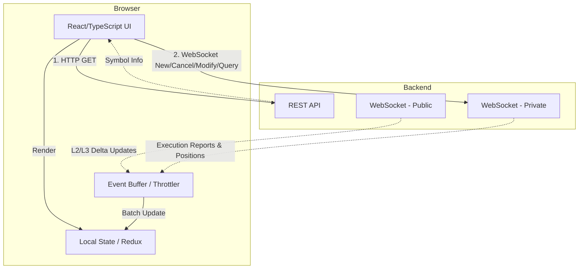

# 前端介面開發與操作指南 (Web Developer & User Guide)

本指南專為 Web 前端工程師、UI/UX 設計師以及希望了解終端介面操作邏輯的使用者所編寫。內容涵蓋了如何透過 API 與交易所核心通訊、資料渲染的最佳實踐、以及使用者在介面上的互動邏輯。

---

## 1. 架構與通訊 (Frontend Architecture)

我們的前端架構採用 **RESTful API** 與 **WebSocket** 混合設計，確保資料的精確性與即時性：

- **RESTful API (查詢型操作)**：
  - 用途：僅用於查詢 `Symbol Info` 基礎資訊 (例如精度、最小跳動點)。
  - 特性：拉取式 (Pull)。
- **WebSocket (即時串流與查詢)**：
  - 用途：處理**所有**的核心交易操作，包含下單/撤單、即時市場報價 (Market Data)、私有成交推播 (Execution Reports)，以及查詢使用者部位 (Positions) 與未平倉委託 (Open Orders)。
  - 特性：推播式 (Push)，確保延遲最小化。

---

## 2. 公開市場資料 (Public Market Data)

為了提供流暢且即時的盤口畫面，請根據以下策略處理 Order Book 渲染：

- **L2 Order Book 深度推播**：
  - **Snapshot (快照)**：連線建立時，先透過 WebSocket 請求一次完整的 Order Book Snapshot (或透過 REST 拉取)。
  - **Delta Update (差異更新)**：後續只需處理 WebSocket 推播過來的增量更新 (Delta)。當收到某價位的數量變更時，直接覆寫或增減本地緩存中的對應節點。
- **即時成交 (Public Trades)**：
  - 獨立的 WebSocket Channel 推播最近的市場撮合紀錄，通常用於繪製 K 線 (Candlestick charts) 與右側的最新成交列表。
- **Ticker (最佳買賣價 BBO)**：
  - 提供目前最高買價 (Best Bid) 與最低賣價 (Best Ask)，適合顯示於全局導覽列或資產總覽。

---

## 3. 介面操作與使用者互動 (User Interactions)

優質的交易所 UI 應該讓交易員能夠以最少的操作次數完成下單與改單。建議實作以下互動邏輯：

### 3.1 價格與數量快速填充 (Click-to-Fill)
- **點擊 Order Book 價格 (Price)**：
  - 當使用者點擊盤口上的任何 BID 或 ASK 價格時，下單面板的「價格」輸入框應自動填入該價格。
- **點擊 Order Book 數量 (Size)**：
  - 點擊盤口的數量時，下單面板除了自動填寫價格，也應自動將該檔位的累計數量填入「數量」輸入框。這有助於交易者快速吃掉特定深度的掛單。

### 3.2 快速修改訂單 (Quick Modify)
- **拖曳修改 (Drag-to-Modify)** *(進階 UI)*：
  - 若在 K 線圖 (TradingView 整合) 上顯示使用者的 Open Orders，允許使用者直接拖曳掛單線來改變 Limit Price。拖曳放開後即刻發出 `Modify` 請求。
- **面板內修改**：
  - 在「當前委託 (Open Orders)」列表中，提供行內編輯 (Inline Edit) 欄位，讓使用者能快速修改價格與數量，並點擊 ✔️ 送出。

### 3.3 快速撤單 (Quick Cancel)
- 在 Order Book 或是 Open Orders 列表中，針對使用者的單提供一個顯眼的 `[X]` 按鈕，點擊後不需經過二次確認對話框 (或提供「不再顯示確認」的選項) 直接發出 `Cancel` 請求。

---

## 4. 前端渲染建議 (Rendering Guidelines)

### 4.1 Order Book 的渲染優化
Order Book 的資料可能每秒更新數十次，若不加以控制會導致嚴重的效能問題：
- **伺服器端節流 (Server-Side Throttling)**：
  - Market Data Server 在後端已實作每 100ms 進行一次批量更新 (Batch Update) 的推播機制，確保網路頻寬不會被瞬間的暴量訂單塞爆。前端只需專心處理收到的 L2Batch。
- **虛擬列表 (Virtual DOM 優化)**：
  - 如果使用 React/Vue，務必對每一行報價設定唯一的 `key` (如價格)，並且確保只有數量改變的該行觸發 Re-render。避免整個元件樹重繪。

### 4.2 樂觀更新策略 (Optimistic UI)
為了對抗網路延遲，提供「瞬時回饋」的使用者體驗：
- 當使用者點擊「取消委託」時，前端可**立刻**將該訂單從 Open Orders 列表中變灰或隱藏 (並顯示轉圈 loading 動畫)。
- 當伺服器真正回傳 `ExecType = Cancelled` 的 WebSocket 訊息時，再徹底移除。
- 若伺服器回傳 `Rejected`，則解除灰色狀態並跳出錯誤通知 (`Toast`) 提示使用者撤單失敗。
- 這種策略可以極大程度降低使用者對於網路延遲的焦慮感，是現代交易平台 UI 設計的標準配備。
