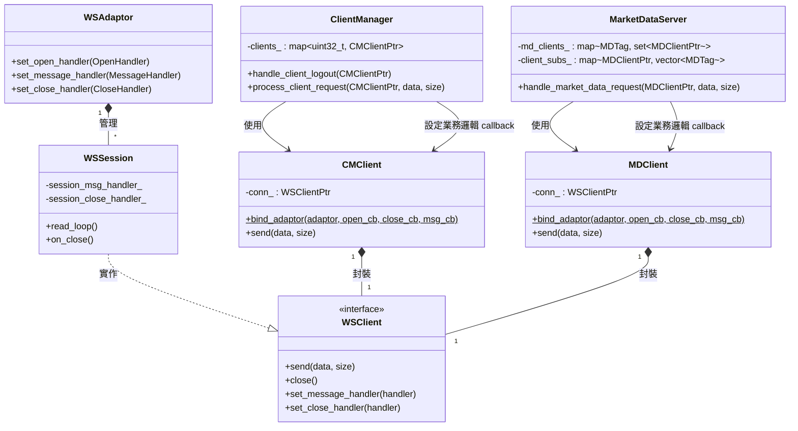
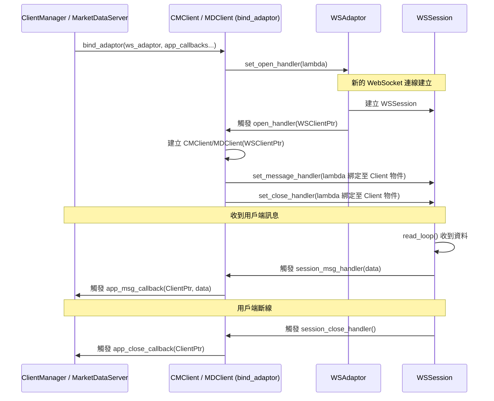

# WebSocket 通訊與應用層隔離架構設計

本文件說明 `Exchange` 系統中 WebSocket 連線層 (`WSAdaptor`, `WSSession`) 與應用業務層 (`ClientManager`, `MarketDataServer`) 之間的解耦與隔離設計。

## 架構核心概念

1. **網路層與應用層完全隔離**：業務層 (`ClientManager`, `MarketDataServer`) 完全不需要看到或操作底層的 `WSClient` 介面。它們只透過高階的 `CMClient` 和 `MDClient` 來操作連線。
2. **單一連線專屬 callback (Per-Session Handlers)**：`WSSession` 除了支援全域的 fallback handler 之外，現在支援「針對單一連線」注入 `message_handler` 與 `close_handler`，這讓生命週期管理變得非常精確且安全。
3. **代理工廠 (bind_adaptor)**：`CMClient` 與 `MDClient` 扮演轉譯的橋樑，透過靜態工廠方法攔截網路層的連線建立事件，自動將其包裝為業務層物件，並將該物件的生命週期與網路層綁定。

## 類別關聯圖 (Class Diagram)

## 連線生命週期與訊息傳遞流程 (Sequence Diagram)

## 元件職責說明

### 網路層 (Networking Layer)
- **`WSAdaptor`**：負責管理底層 Boost.Asio 執行緒與 Acceptor，維護所有活躍的 `WSSession`。提供全域層級的 Handler 退路機制。
- **`WSClient` (Interface)**：定義對外連線操作（例如 `send`）與專屬 callback（`set_message_handler`, `set_close_handler`）的介面。
- **`WSSession`**：`WSClient` 的具體實作。它會在收到訊息或斷線時，優先檢查有沒有設定「專屬 callback (session_msg_handler_)」。如果有，就只呼叫專屬 callback；如果沒有，才退回 `WSAdaptor` 的全域 callback。這樣能保證在不同伺服器元件（例如未遷移的元件）下依舊相容。

### 封裝層 (Wrapper Layer)
- **`CMClient` / `MDClient`**：這兩個類別是極度輕量化的封裝，其建構子要求傳入不可變的 `WSClientPtr`，代表它們**生來就與單一連線綁定**。
- **`bind_adaptor()`**：這是一個極具巧思的靜態工廠方法。它取代了原先在 `ClientManager` 中繁雜的 `ws_map_` 查表法。每當 `WSAdaptor` 通知有新連線時，它會把該 `WSClient` 轉成 `CMClient`，然後**把自己生成的 `CMClient` 透過 Lambda 捕獲的方式，直接註冊回底層 `WSClient` 的專屬 callback 中**。這樣從底層上來的事件，就自然帶著 `CMClient` 物件了。

### 業務層 (Application Layer)
- **`ClientManager` / `MarketDataServer`**：完全專注於業務邏輯。在建構時期呼叫 `bind_adaptor` 並傳入自己處理業務的 Callback 函數。
- 由於底層已經隔離，業務層再也不需要持有醜陋的 `std::map<WSClient*, ...>`，也不需要面對各種 lock 與生命週期的 race condition 問題。當收到斷線通知時，傳過來的直接就是要被清理的業務 Client 物件。
